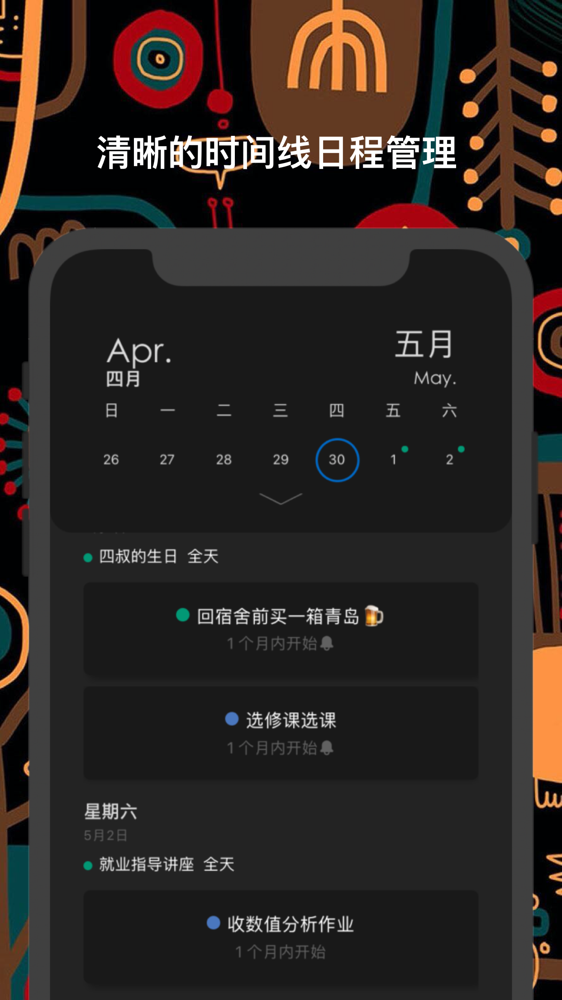
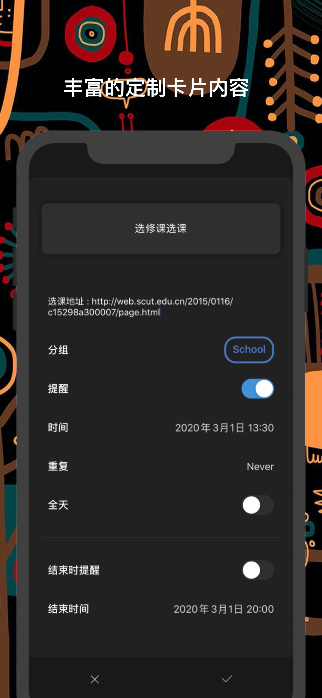
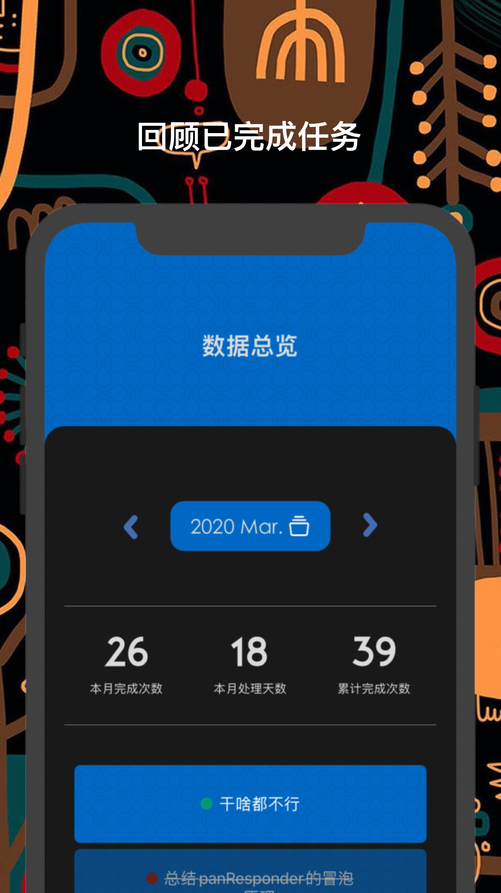

****

[]()

AbandonList是一款运行在IOS端的日程待办管理App。

> 之所以这样说是因为它的数据源直接取自手机的日历数据。无需导入也无需备份，下载App后日历里的日程也可以直接显示,非常的方便

<div style="display:flex;justify-content:space-around;align-items: center;width:100%;">
  
  
  
</div>
<div style="display:flex;justify-content:space-around;align-items: center;width:100%;">
  
  
  
</div>

### 配置运行环境

* 安装依赖项

使用yarn

```
yarn
```

或使用npm

```
npm install
```

* 某些包需要手动链接(例如```react-native-calendar-events```)

```
react-native link
```

* 安装pod

```
cd ios && pod install && cd ..
```

### Extra

如果字体无法显示，参见[react-native添加字体说明](./AddFont.md)

