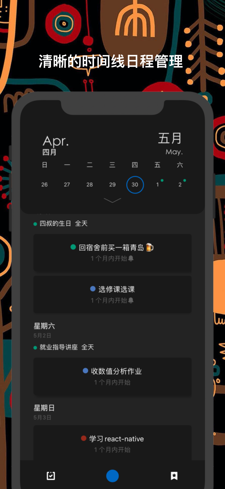
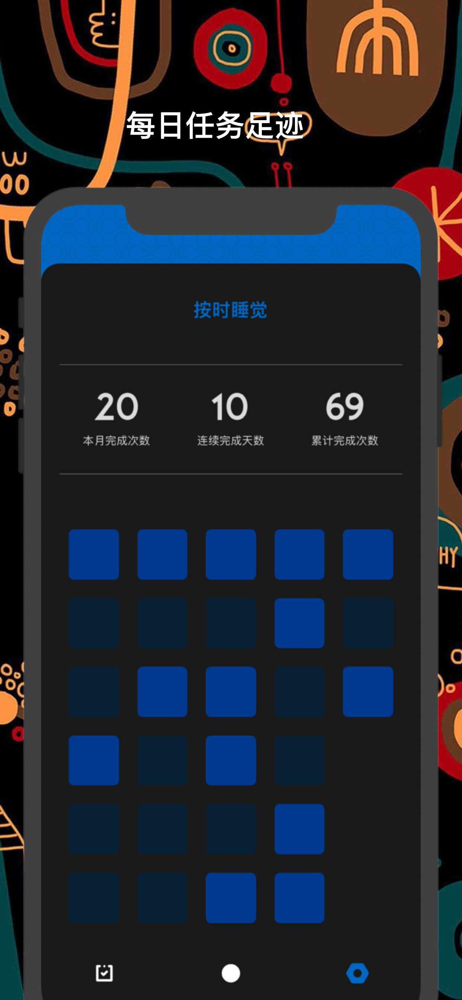
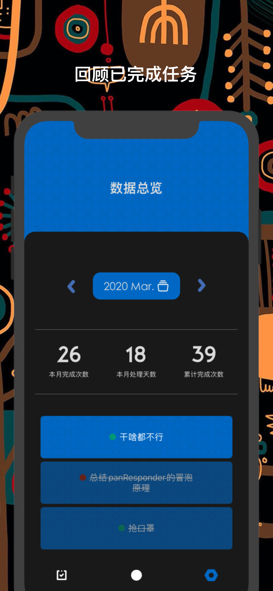

****

[]()

AbandonList是一款运行在IOS端的日程待办管理App。

> 之所以这样说是因为它的数据源直接取自手机的日历数据。无需导入也无需备份，下载App后日历里的日程也可以直接显示,非常的方便

功能点:

1. 日历组件
    * 允许周历展开变成月历
    * 周历和月历都允许左右滑动
    * 动画设计优秀
2. 日程卡片
    * 点击弹开显示详细信息
    * 左滑到底跳入编辑页
    * 右滑弹出 完成/删除 按钮
    * 卡片显示 分组标识圆点/事件名/距离事件开始的详细时间
3. 原生日历数据模块
    * 直接读取原生数据，和已有事件同步，无需再做备份
    * 支持控制可见分组, 创建新的分组
4. 原生通知模块
    * 可以为事件/每日待办添加提醒功能, 支持所有重复场景
5. 每日待办
    * 此处没有调用原生的待办功能，直接用JSON数据写入本机存储。由于暂时没有开发备份，一旦删除App数据清空
6. 每月数据报表
    * 支持查看当月已完成/删除的事项
    * 类似```GitHub```的色格展示，完成数量越多，颜色越鲜艳
    * 支持每日任务单独查看
<div style="display:flex;justify-content:space-around;align-items: center;width:100%;">
  
  
  
</div>
<div style="display:flex;justify-content:space-around;align-items: center;width:100%;">
  
  
  
</div>

### 配置运行环境

* 安装依赖项

使用yarn

```
yarn
```

或使用npm

```
npm install
```

* 某些包需要手动链接(例如```react-native-calendar-events```)

```
react-native link
```

* 安装pod

```
cd ios && pod install && cd ..
```

### Extra

如果字体无法显示，参见[react-native添加字体说明](./AddFont.md)

